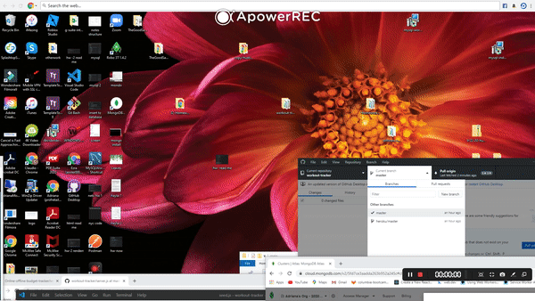

# Unit 17: NoSQL

## Overview
In the late 90s and early 2000s, developers began to explore database options that allowed their web applications to handle unstructured data to meet the growing and ever-changing demands of users and address the limitations of the relational model. While these alternative databases existed for decades prior, they didn’t receive the label NoSQL until this time period.  

The structure of a NoSQL database is something other than a table. There are several different types of NoSQL databases, such as key-value and graph. In this unit we will learn MongoDB, a document-oriented NoSQL database. MongoDB documents correspond to a row, or record, in SQL, but unlike rows, documents are analogous to JSON objects. You can see why MongoDB is a popular choice for Node.js developers! 

Rather than object-relational mapping, we will implement object-_document_ mapping, or ODM, with Mongoose.js. 

## Key Topics
* NoSQL
* MongoDB
* Object-document mapping
* Mongoose.js
* CRUD

## Comprehension Check
You will be employer-ready if you can answer the following questions:
1. What is the difference between SQL and NoSQL?
2. What is object-document mapping? 
3. What is the equivalent of Sequelize associations in Mongoose.js? 

## Learning Objectives
You will be employer-competitive if you are able to:
* Explain the difference between SQL and NoSQL
* Configure Heroku for deployment of a Node.js application using MongoDB
* Explain and execute CRUD methods with MongoDB, using both the  and Mongoose.js
* Use both a GUI and the Mongo command prompt to interface with a database
* Integrate Mongoose in a full-stack web application
* Create query builders to populate documents using refs

## Homework: Workout Tracker
Create and deploy full-stack workout tracker application. This assignment will require you to create Mongo database with a Mongoose schema and handle routes with Express.

## Deployed Project link :
https://frozen-gorge-55124.herokuapp.com/

## Helpful Links
* [NoSQL](https://en.wikipedia.org/wiki/NoSQL)
* [MongoDB Website](https://www.mongodb.com/)
* [Robo 3T Website](https://robomongo.org/download)
* [MongoJS Documentation](https://www.npmjs.com/package/mongojs)
* [Mongoose Documentation](http://mongoosejs.com/docs/guide.html)
